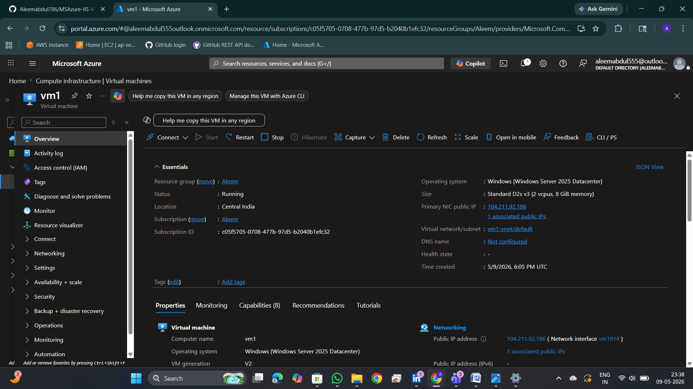
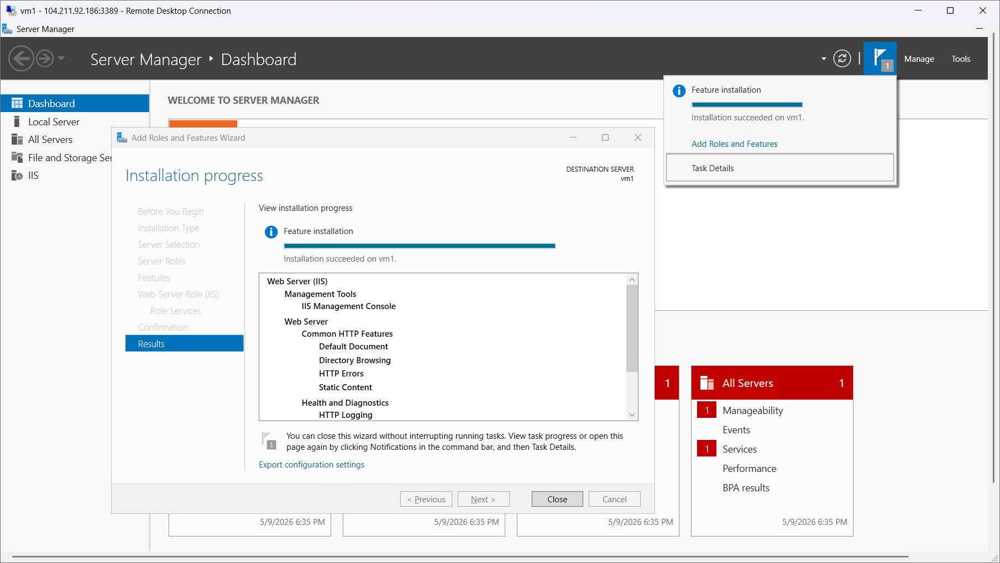
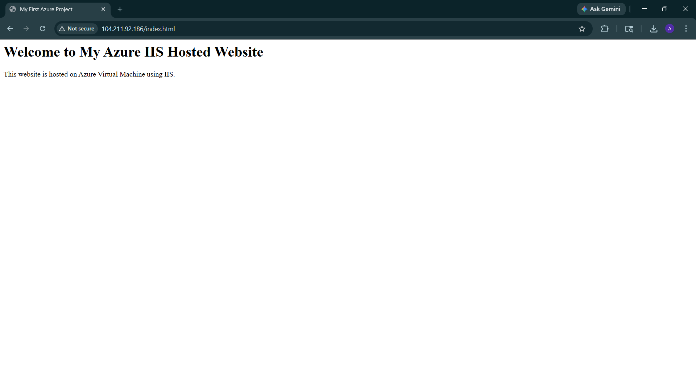

# MSAzure-IIS-Web-Hosting-Project
This project demonstrates hosting a static HTML website on an Azure Virtual Machine using IIS Web Server and accessing it through a public IP address.

## Technologies Used
- Microsoft Azure
- Azure Virtual Machine
- IIS Web Server
- Windows Server
- HTML
- GitHub

## Steps Performed
1. Created Azure Virtual Machine
2. Installed IIS Web Server
3. Hosted HTML webpage
4. Accessed website using Public IP

## Screenshots

### VM Creation

### IIS Installation

### HTML Code

### Website Output

